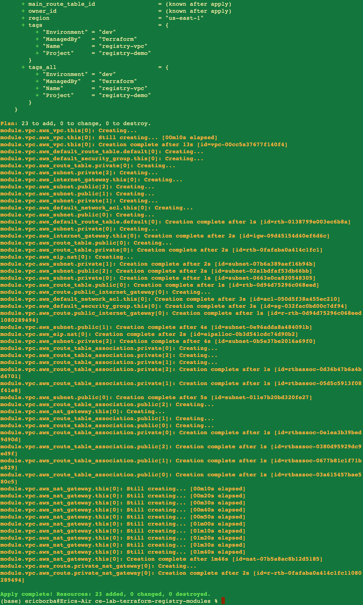
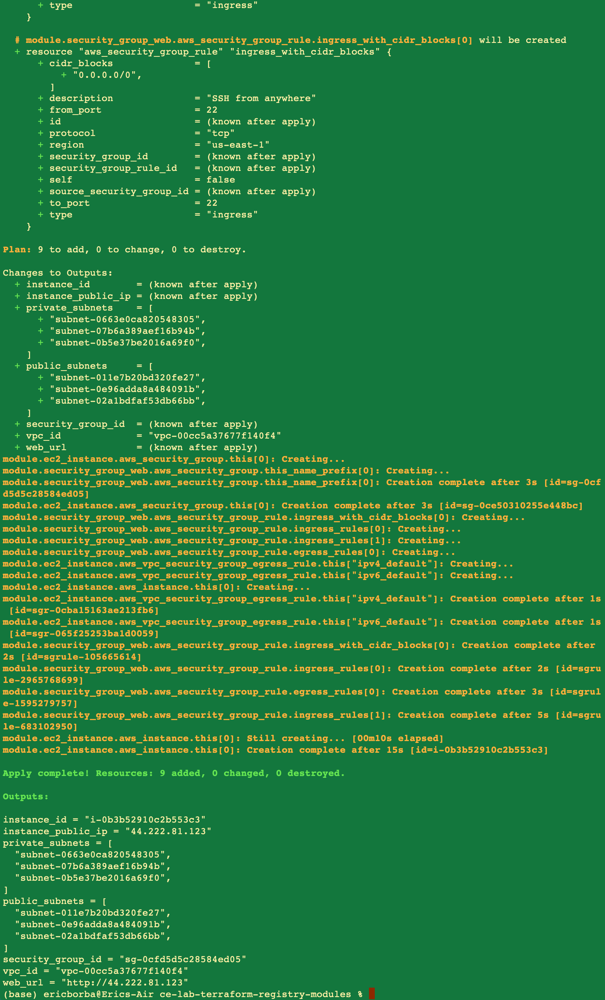
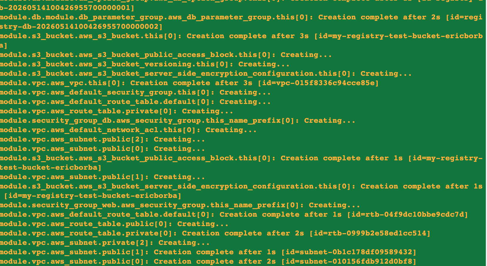
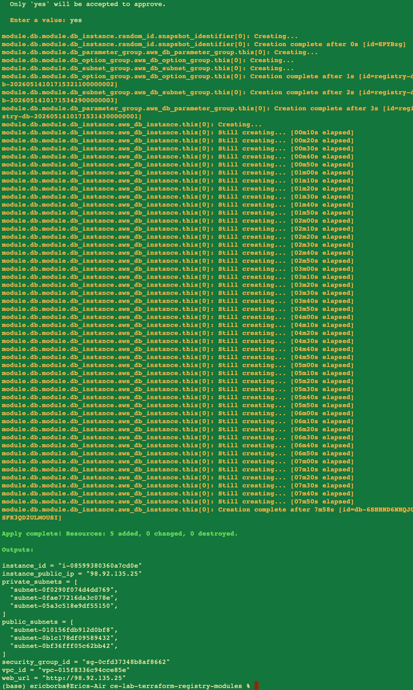
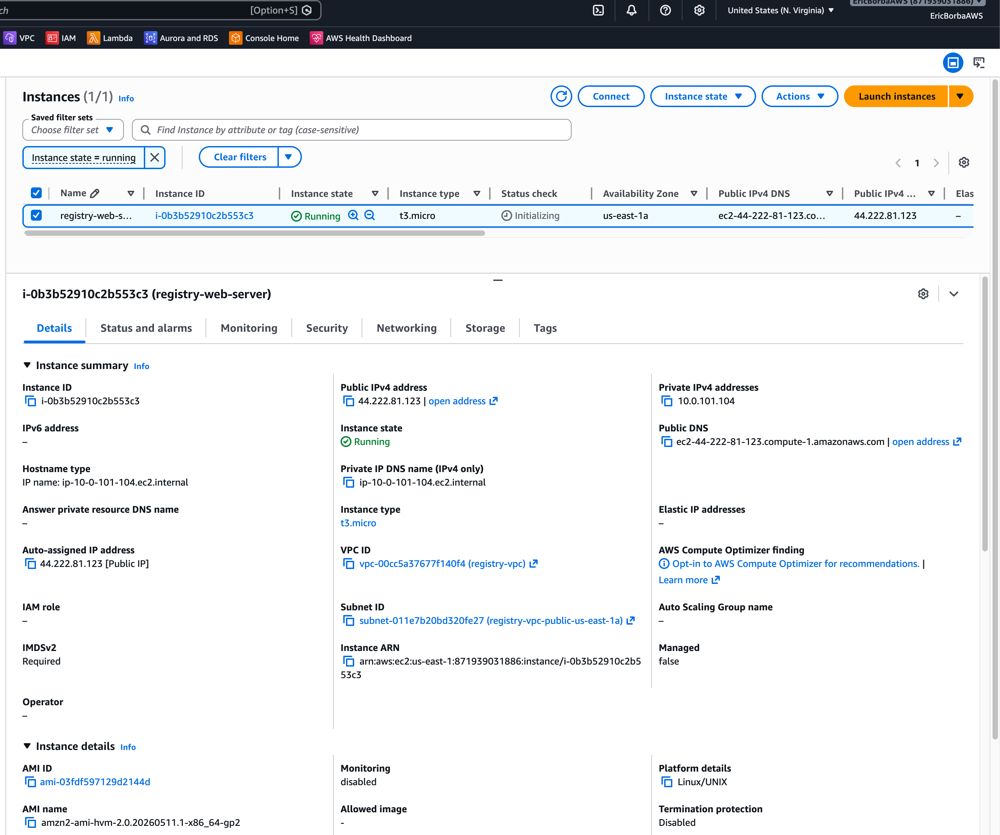
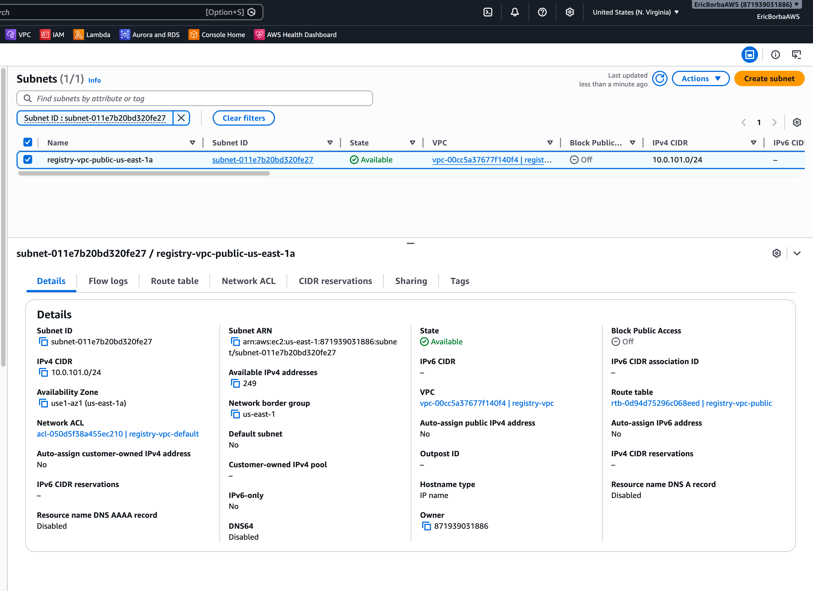
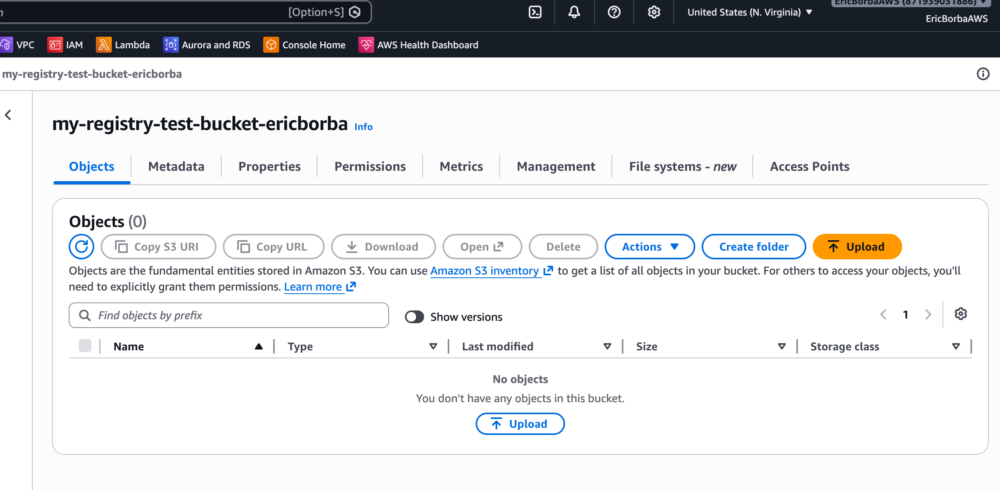
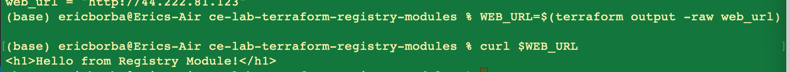
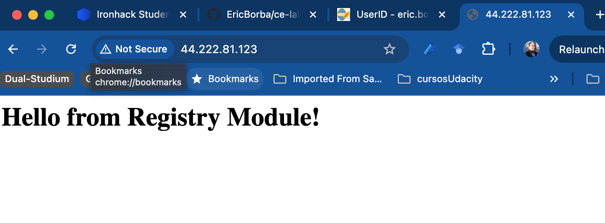

# Lab M4.06 - Terraform Registry Modules

**Course:** Cloud Engineering Bootcamp - Week 4  
**Lab:** M4.06 - Use Community Modules from Terraform Registry

---

## Objectives

- Use production-grade modules from the Terraform Registry
- Understand module versioning and pinning
- Combine multiple community modules into a complete infrastructure stack
- Compare community modules versus custom-built modules

---

## Infrastructure Deployed

A multi-tier AWS environment was deployed entirely using official community modules from the Terraform Registry:

| Resource | Module | Version |
|---|---|---|
| VPC | `terraform-aws-modules/vpc/aws` | 6.6.1 |
| EC2 Instance | `terraform-aws-modules/ec2-instance/aws` | 6.4.0 |
| Security Group (Web) | `terraform-aws-modules/security-group/aws` | 5.3.1 |
| Security Group (DB) | `terraform-aws-modules/security-group/aws` | 5.3.1 |
| S3 Bucket | `terraform-aws-modules/s3-bucket/aws` | 5.13.0 |
| RDS (MySQL) | `terraform-aws-modules/rds/aws` | 7.2.0 |

**AWS Provider:** `hashicorp/aws ~> 6.42.0`  
**Region:** `us-east-1`

---

## Architecture

```
us-east-1
└── VPC: 10.0.0.0/16 (registry-vpc)
    ├── Public Subnets: 10.0.101.0/24, 10.0.102.0/24, 10.0.103.0/24
    │   └── EC2: registry-web-server (t3.micro) ← Security Group: web-server-sg
    ├── Private Subnets: 10.0.1.0/24, 10.0.2.0/24, 10.0.3.0/24
    │   └── RDS: registry-db (MySQL 8.0, db.t3.micro) ← Security Group: db-server-sg
    └── NAT Gateway (single, cost-optimised)

S3: my-registry-test-bucket-ericborba (private, versioned, AES256)
```

Network security follows least-privilege:
- `web-server-sg`: allows HTTP (80), HTTPS (443), SSH (22) inbound from `0.0.0.0/0`
- `db-server-sg`: allows MySQL (3306) inbound **only from** `web-server-sg` — no public exposure

---

## Repository Structure

```
ce-lab-terraform-registry-modules/
├── main.tf          # All module declarations and configuration
├── outputs.tf       # VPC, subnet, EC2 and security group outputs
├── README.md        # This file
├── COMPARISON.MD    # Custom module vs Registry module analysis
├── .terraform.lock.hcl
└── screenshots/
    ├── deployingOfficialVPCModule.png
    ├── deployingOfficialEC2SecurityGroup.png
    ├── deployingS3.png
    ├── deployingRDS.png
    ├── checkingAWSConsole.png
    ├── checkingAWSConsoleSubnets.png
    ├── checkingS3DeploymentAWSConsole.png
    ├── testingDeploymentCurl.png
    └── testingDdeploymentBrowser.png
```

---

## Steps Performed

### 1. VPC Module

Deployed a fully-configured VPC using `terraform-aws-modules/vpc/aws` with:
- 3 public + 3 private subnets spread across AZs `us-east-1a/b/c`
- Single NAT Gateway for cost savings
- DNS hostnames enabled



---

### 2. Security Groups + EC2 Instance

Deployed the web security group (`web-server-sg`) and an EC2 instance using the official modules. The instance runs Apache (`httpd`) via `user_data`, serving a simple HTML page. Public IP was auto-assigned.



---

### 3. S3 Bucket

Deployed a private, versioned S3 bucket with:
- ACLs fully disabled (`BucketOwnerEnforced`)
- All public access blocked
- Server-side encryption (AES256)



---

### 4. RDS (MySQL)

Deployed a MySQL 8.0 RDS instance in the private subnets, isolated from the internet. A dedicated DB security group allows MySQL traffic only from the web tier.



---

### 5. Verification

**AWS Console — EC2 instance running:**



**AWS Console — VPC public subnet details:**



**AWS Console — S3 bucket created:**



**Web server verified via `curl`:**

```bash
WEB_URL=$(terraform output -raw web_url)
curl $WEB_URL
# <h1>Hello from Registry Module!</h1>
```



**Web server verified in browser (IP: 44.222.81.123):**



---

## Outputs

| Output | Description |
|---|---|
| `vpc_id` | VPC ID |
| `public_subnets` | List of public subnet IDs |
| `private_subnets` | List of private subnet IDs |
| `instance_id` | EC2 instance ID |
| `instance_public_ip` | Public IP of EC2 instance |
| `web_url` | HTTP URL to access the web server |
| `security_group_id` | Web security group ID |

---

## Key Takeaways

- Pinning module versions (`version = "x.y.z"`) is essential for reproducible infrastructure.
- Community modules from the Terraform Registry encapsulate AWS best practices (subnet grouping, NAT HA, encryption defaults) out of the box.
- Composing multiple modules together requires careful wiring of outputs (e.g. `module.vpc.vpc_id` → `vpc_id` argument in security group and RDS modules).
- The `object_ownership = "BucketOwnerEnforced"` pattern on S3 is the current AWS-recommended way to disable ACLs entirely.

---

## Grading (100 pts)

| Criteria | Points |
|---|---|
| VPC module usage | 25 pts |
| EC2 module usage | 25 pts |
| Module integration | 20 pts |
| Comparison analysis | 20 pts |
| Documentation | 10 pts |
